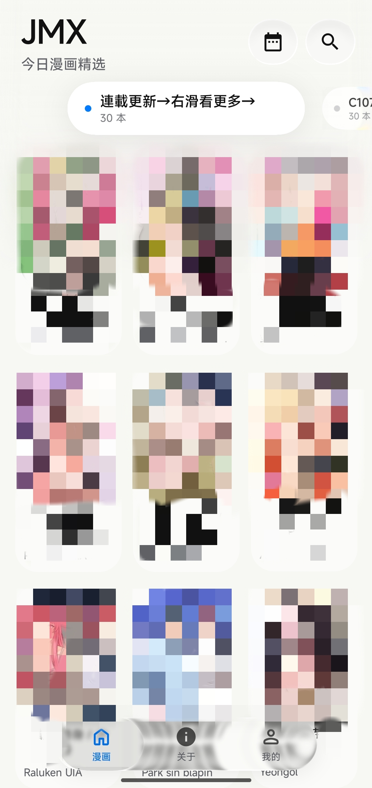
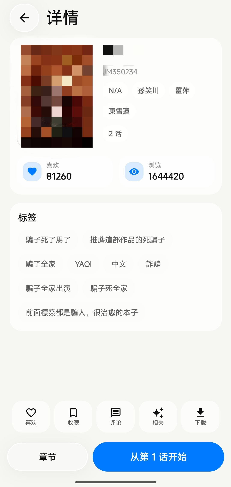
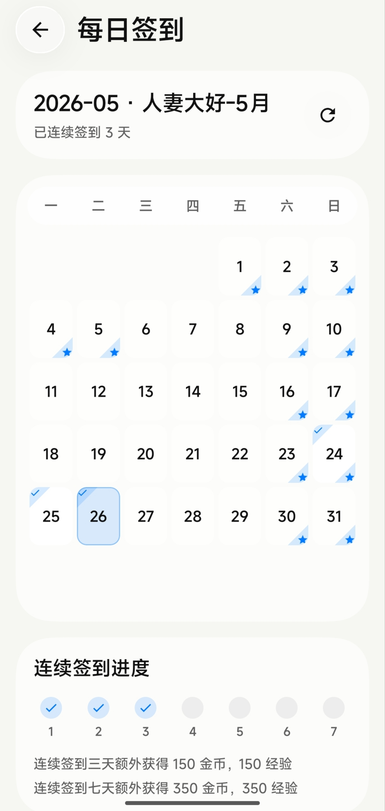
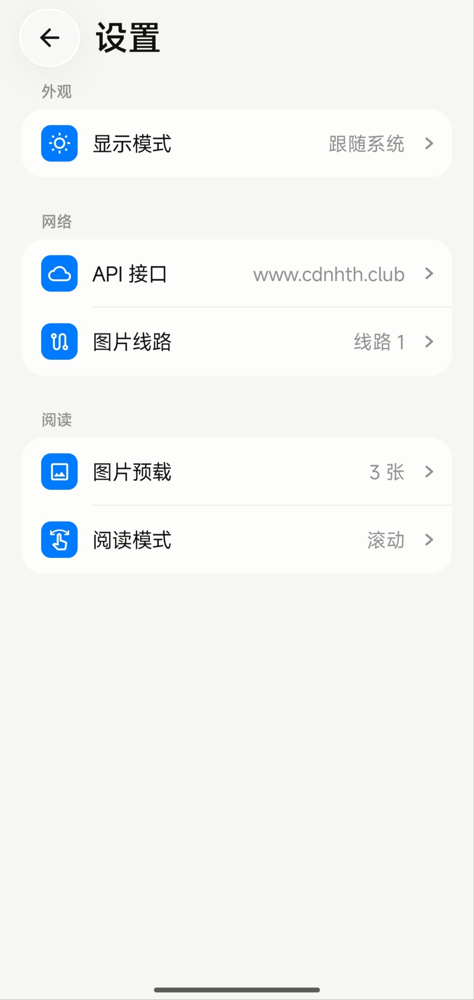

# 🚫 请勿在任何公开平台宣传本软件

本项目不接受任何形式的公开宣传、搬运、引流或二次包装推广。若出现公开传播、营销引流、恶意分发或其他可能影响项目存续的行为，维护者可以随时归档、隐藏或删除仓库，并停止提供任何编译产物。

# JMX

> 🔞 R18 警告：未满 18 岁请勿下载、编译、安装或使用本项目。

JMX 是一个使用 Kotlin 与 Jetpack Compose 开发的 Android 第三方客户端，用于浏览、搜索、阅读和管理 JMComic / 禁漫天堂相关内容。项目以简洁、轻量和可维护为核心目标，在原有移动端客户端能力基础上，重新组织了界面结构、交互路径和视觉系统。

JMX 不是 JMComic / 禁漫天堂官方应用，也没有任何官方网站。若后续提供安装包，GitHub Release 与 GitHub Actions 构建产物将是唯一推荐下载渠道。

## 📷 预览

<p align="center">
  
  
  
  
</p>

## ✨ 功能概览

- 🏠 首页浏览：支持今日精选、分类切换、列表刷新、搜索入口与每周推荐入口。
- 🔍 搜索系统：支持关键词搜索、排序筛选、搜索历史与搜索结果分页加载。
- 📖 漫画详情：支持封面、作者、标签、喜欢数、浏览数、简介、章节、评论、相关作品与下载入口。
- ▶️ 阅读体验：支持滚动阅读、分页阅读、章节切换、进度定位与图片预加载。
- 👤 账号能力：支持 JM 账号登录、自动登录、用户资料、收藏、历史、评论与签到数据同步。
- 📅 每日签到：支持签到状态展示、连续签到进度与奖励说明。
- 💬 评论能力：支持评论列表、历史评论、发表评论与评论详情展示。
- 📥 下载管理：支持后台下载、下载状态管理、本地缓存与压缩包输出。
- 🎨 Apple 风格 UI：采用大标题、分组列表、柔和卡片、底部导航、轻量动效与 Liquid Glass 视觉系统。
- 🧹 性能与体积优化：限制图片缓存、清理临时缓存、缩小构建产物、减少不必要的运行时压力。

## 🧭 设计方向

JMX 的界面不再沿用 Material Design 3 / MD3E 的默认视觉，而是面向 Apple 风格重新整理：

- 信息层级更直接，减少无意义装饰。
- 大字号标题与清晰分组，降低用户理解成本。
- Liquid Glass 用于导航、浮层和关键操作，不滥用全屏强模糊。
- 交互优先追求稳定、跟手和轻量，而不是堆叠动画。
- 内容优先，界面服务于浏览与阅读。

Liquid Glass 相关效果参考并集成了 Kyant0 的 AndroidLiquidGlass / Backdrop 模块。

## 📜 项目来源与许可

本项目整理自第三方 JM 移动客户端方向，并参考了以下项目和资料：

- 原始客户端基础：[Dedicatus546/jm-mobile](https://github.com/Dedicatus546/jm-mobile)
- Liquid Glass / Backdrop：[Kyant0/AndroidLiquidGlass](https://github.com/Kyant0/AndroidLiquidGlass)
- API 行为参考：[jmcomic-api-java documentation](https://jmcomic-api-java.readthedocs.io/zh-cn/latest/)

本仓库当前使用 GPL-3.0 许可证发布，完整条款见 [LICENSE](LICENSE)。第三方代码、文档与资源仍遵循其原始许可证。AndroidLiquidGlass 相关代码保留在 `third_party/AndroidLiquidGlass/`，并附带其原始 Apache-2.0 许可文件。

## ⚠️ 免责声明

本应用程序与 JMComic / 禁漫天堂及其关联方无任何隶属、合作、授权或官方认可关系。

### 数据来源

- 本应用仅通过用户主动访问的第三方服务获取公开返回的数据。
- 本应用不访问第三方服务数据库。
- 本应用不进行注入攻击、越权请求、绕过认证或获取非公开用户隐私数据。
- 本应用不保证第三方服务的可用性、完整性、准确性或实时性。

### 使用限制

- 本项目仅用于技术研究、学习交流、移动端体验优化和界面设计实验。
- 本项目不提供商业化服务。
- 用户应遵守所在地区法律法规、平台规则和账号服务条款。
- 不得将本项目用于任何非法用途。

### 内容版权

- 漫画、图片、文本、评论及相关内容版权归原站、原作者、制作方或发行方所有。
- 本应用不存储、不修改、不售卖、不主张拥有任何第三方版权内容。
- 若权利方认为本项目存在不当引用、侵权风险或其他问题，请通过 GitHub 仓库功能联系维护者处理。

### 责任边界

使用本项目所产生的一切后果由用户自行承担。维护者不对账号风险、内容访问风险、网络请求结果、下载缓存行为或任何间接损失承担责任。

最后更新日期：2026-05-26

## 🧱 当前架构

项目采用 Gradle 多模块结构：

```text
JMX/
├── app/                                      主 Android 应用
│   ├── src/main/java/dev/jmx/client/data     远程 DTO、API 服务、转换器与领域模型
│   ├── src/main/java/dev/jmx/client/database Room 数据库、DAO 与本地实体
│   ├── src/main/java/dev/jmx/client/repository 数据访问边界
│   ├── src/main/java/dev/jmx/client/storage  本地存储与安全存储
│   ├── src/main/java/dev/jmx/client/store    运行时状态管理
│   ├── src/main/java/dev/jmx/client/ui       Compose 页面、组件、导航、Liquid Glass 与 ViewModel
│   ├── src/main/java/dev/jmx/client/worker   WorkManager 后台任务
│   └── src/main/res                          图标、主题、字符串与资源文件
├── third_party/AndroidLiquidGlass/backdrop   本地 Backdrop / Liquid Glass 模块
├── gradle/libs.versions.toml                 依赖版本目录
├── README.md                                 项目说明
└── LICENSE                                   GPL-3.0 许可证
```

整体数据流：

```text
Compose Screen -> ViewModel -> Repository -> Retrofit / Room -> StateFlow -> Compose Screen
```

阅读数据流：

```text
AlbumDetail -> AlbumReadViewModel -> AlbumRepository -> Image State -> Reader UI
```

下载数据流：

```text
DownloadScreen -> DownloadViewModel -> DownloadManager -> WorkManager Worker -> Room -> UI
```

## 🛠 技术栈

- Kotlin 2.3.x
- Java / JDK 25
- Android Gradle Plugin 9.1.x
- Jetpack Compose
- Navigation Compose
- ViewModel + StateFlow
- Retrofit 3 + OkHttp
- Gson
- Coil
- Room + KSP
- Paging 3
- WorkManager
- Koin
- AndroidLiquidGlass / Backdrop

## 🧰 构建环境

推荐环境：

- Android Studio 新版本
- JDK 25
- Android SDK Platform 36
- Gradle Wrapper 使用仓库内置版本
- 最低支持 Android 12，API 31
- 目标 SDK 36

本仓库不提交 `local.properties`。请使用 Android Studio 自动生成，或设置环境变量 `ANDROID_HOME`。

## 🚀 本地运行

克隆项目：

```bash
git clone https://github.com/Sakura-TWT/JMX.git
cd JMX
```

Windows PowerShell：

```powershell
.\gradlew.bat :app:assembleDebug --no-daemon
```

Linux / macOS：

```bash
./gradlew :app:assembleDebug --no-daemon
```

生成的 APK 位于：

```text
app/build/outputs/apk/debug/
```

## ✅ 代码约定

- UI 优先使用 Jetpack Compose。
- 页面状态通过 StateFlow 暴露，事件通过回调或一次性状态分发。
- LazyColumn、LazyVerticalGrid、LazyRow 必须使用稳定且唯一的 key。
- 网络分页与本地缓存需要避免重复项导致 Compose key 冲突。
- 修改阅读、下载、登录、缓存、图片加载相关逻辑后，应至少执行一次 debug 构建并在真机验证。

## 🗺️ TODO

- 继续压缩 Liquid Glass 高斯模糊与绘制成本。
- 进一步整理 README 截图与 Release 说明。
- 补充更完整的开源许可证清单。
- 对搜索、阅读、下载链路补充更稳定的错误恢复。
- 优化图片资源体积与启动阶段首帧稳定性。

## 🤝 贡献说明

当前项目仍处于快速重构阶段。提交 PR 前请确认：

```bash
./gradlew :app:assembleDebug --no-daemon
```

如涉及 UI、阅读、下载、账号或网络层，请在说明中写明验证设备、Android 版本和复现路径。

## 📄 许可证

本项目采用 GPL-3.0 许可证。完整条款请参阅 [LICENSE](LICENSE)。

第三方组件保留其原始许可证与版权声明。
